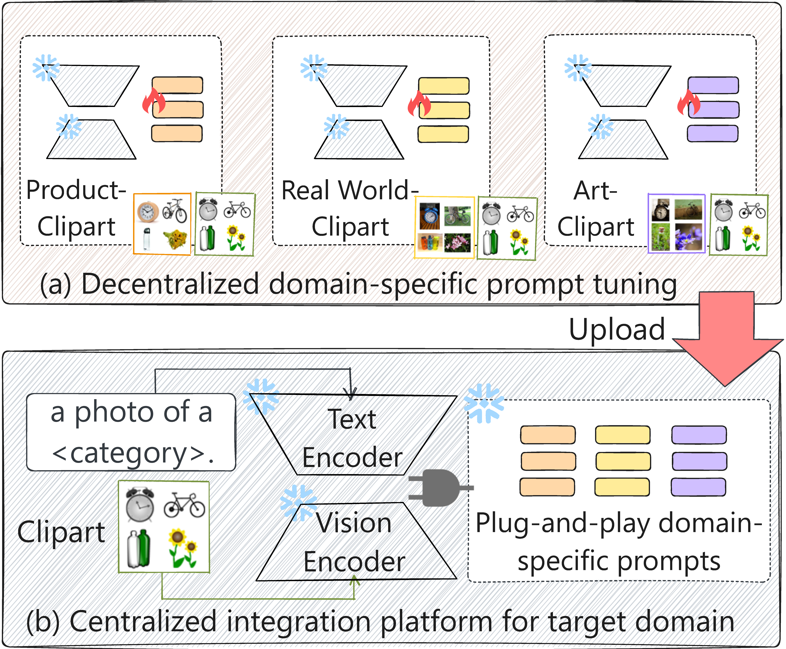
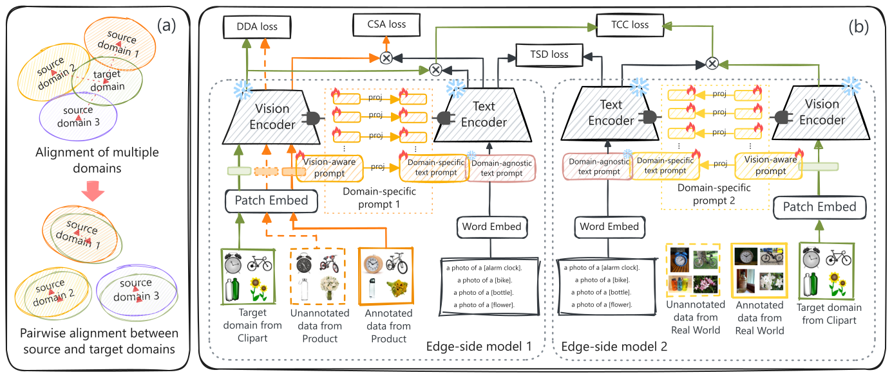

# VAMP framework for the UMFDA

This is our code for our paper "Vision-aware Multimodal Prompt Tuning for Uploadable Multi-source Few-shot Domain Adaptation".

<p align="center" class="half">


</p>

## Install

* Build conda enviroment

  ```
  #create a conda environment
  conda create -y -n VAMP python=3.9

  # Activate the environment
  conda activate VAMP

  #Install torch and torchvision (refer to https://pytorch.org)
  pip install torch==2.1.2+cu118 torchaudio==2.1.2+cu118 torchvision==0.16.2+cu118
  ```
* Install `dassl` enviroment. Follow the instructions described [here](https://github.com/KaiyangZhou/Dassl.pytorch#installation) to install it.
* Clone this project and install requirements

  ```
  pip install -r requirements.txt
  ```

## Download Dataset

Please download the [OfficeHome](https://www.hemanthdv.org/officeHomeDataset.html) and [DomainNet](https://ai.bu.edu/M3SDA/) datasets and put them into the `data/` folder.

Please refer to the corresponding splits of [OfficeHome](https://github.com/zhengzangw/PCS-FUDA/tree/master/data/splits/office_home) and [DomainNet](https://github.com/zhengzangw/PCS-FUDA/tree/master/data/splits/domainnet) from PCS-FUDA. Put them into the `data/OfficeHome/splits/` or `data/DomainNet/splits/` folders.

## Train and Evaluate

Please revise the dataset path in the configure file `configs/trainer/VAMP` and run the commands from `scripts/VAMP/`.

For example, the training and evaluation commands for VAMP on OfficeHome as follows.

`bash scripts/VAMP/main_officehome.sh`

After the experiments are finished, you can use `parse_test_res.py` to calculate the average results instead of mannually looking into the log files. For the experiments of 3% OfficeHome, the file structure of `results/` is

```
results
|-- VAMP/
|    |-- OfficeHome/
|    |    |-- shot_p3/
|    |    |    |-- seed1/
|    |    |    |-- seed2/
|    |    |    |-- seed3/
|    |    |    |-- seed5/
```

To calculate the average results for this folder, you can run

`python parse_test_res.py results/VAMP/OfficeHome/shot_p3`

## Acknowledgements

Our code is based on [CoOp](https://github.com/KaiyangZhou/CoOp), [MaPLe](https://github.com/muzairkhattak/multimodal-prompt-learning) and [DAPL](https://github.com/LeapLabTHU/DAPrompt/tree/main) repository. We thank the authors for releasing their code.
